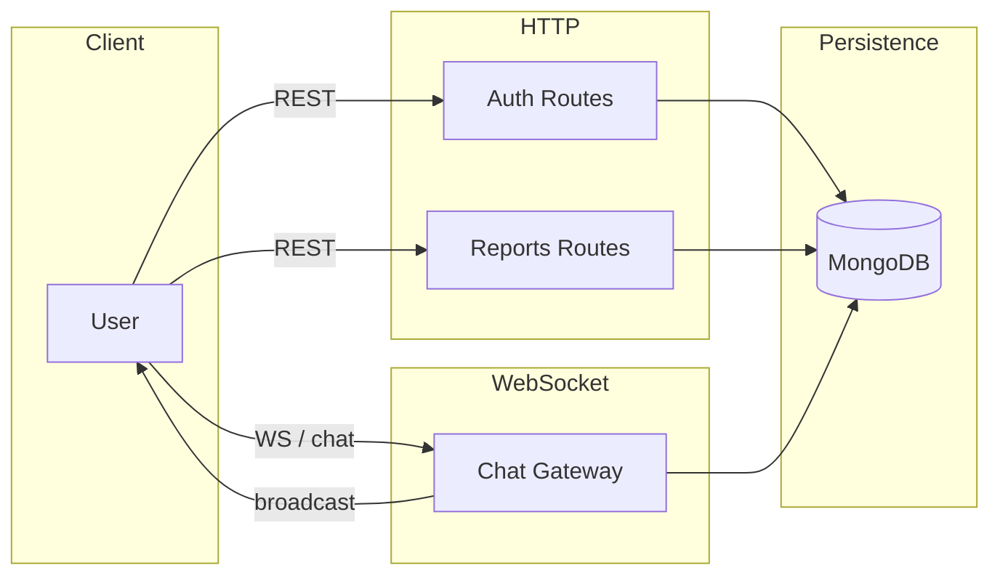
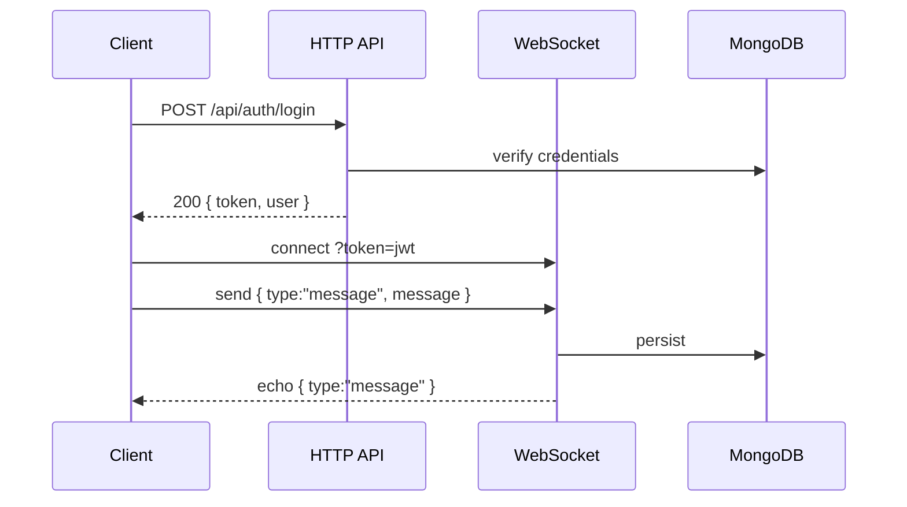

# ChoufPrice-DZ-Platform Backend

Express + MongoDB backend providing auth, price reports CRUD, and real-time chat via WebSocket.

## 🚀 Quick Start

1. Install deps

```bash
npm install
```

2. Configure env

```bash
cp .env.example .env
# edit .env
```

3. Run

```bash
npm run dev   # nodemon
# or
npm start     # node
```

## 🧩 Features

- JWT auth (register, login, me)
- Price reports CRUD and voting
- WebSocket chat with history + delete
- CORS, Helmet, logging (morgan)

## 🌐 Endpoints (summary)

- Health: `GET /health`
- Auth: `POST /api/auth/register`, `POST /api/auth/login`, `GET /api/auth/me`
- Reports: `GET /api/reports`, `POST /api/reports`, `POST /api/reports/:id/vote`, `DELETE /api/reports/:id`, `GET /api/reports/mine`
- Chat history: `GET /api/chat/history`
- WebSocket chat: `ws://<host>:<port>/ws/chat?token=<jwt>`

Full details: see `API_DOCS.md`.

## 🔧 Environment

- `PORT` (default 4000)
- `MONGODB_URI` (required)
- `JWT_SECRET` (required)
- `FRONTEND_ORIGIN` (CORS allowlist; supports regex for Vercel)

## 📜 Scripts

- `npm run dev` — start with nodemon
- `npm start` — start with node

## 🗺️ Architecture



## 🧠 Tech Stack

- Express, Mongoose, jsonwebtoken, bcrypt, helmet, cors, morgan, ws

## 📝 Notes

- Tokens expire in 7d (see `src/routes/auth.js`).
- Keep `.env` out of git (already ignored).

---

## 🎥 Presentation

- Demo video: https://youtu.be/your-backend-demo
- Slide deck: https://slides.com/your-backend-deck

Suggested backend demo flow:

- 1. `GET /health` to show service up
- 2. Register + login to obtain JWT
- 3. `GET /api/reports` then `POST /api/reports` and `POST /api/reports/:id/vote`
- 4. Connect to `ws://localhost:4000/ws/chat?token=<jwt>` and send + delete messages (broadcast)

Sequence (auth + chat):



---

## ✅ Assessor Guide

- Documentation (20%): Clear setup, endpoints summary, architecture + sequence diagrams, API_DOCS.md for details
- Implementation (40%): Auth, CRUD + vote, WebSocket chat with delete, CORS/Helmet, logging
- Presentation/Video (30%): Demo script above with real requests and WS echo
- Creativity (10%): Secure delete ownership, clean layered architecture, real-time UX

## 🧪 Quick Test

```bash
# Health
curl http://localhost:4000/health

# Register
curl -X POST http://localhost:4000/api/auth/register \
   -H "Content-Type: application/json" \
   -d '{"email":"test@example.com","password":"pass123","name":"Test"}'

# Login
TOKEN=$(curl -s -X POST http://localhost:4000/api/auth/login \
   -H "Content-Type: application/json" \
   -d '{"email":"test@example.com","password":"pass123"}' | jq -r '.token')

# Create report
curl -X POST http://localhost:4000/api/reports \
   -H "Authorization: Bearer $TOKEN" -H "Content-Type: application/json" \
   -d '{"product":"Sugar","price":150,"city":"Algiers"}'

# Chat (WebSocket)
# Use wscat or browser: ws://localhost:4000/ws/chat?token=$TOKEN
```
